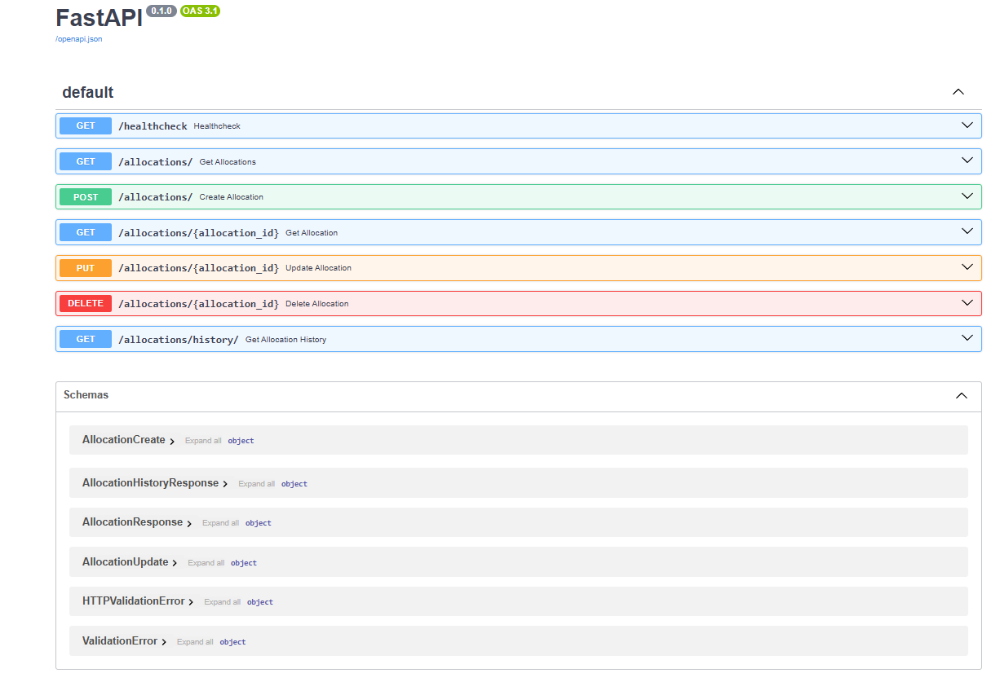
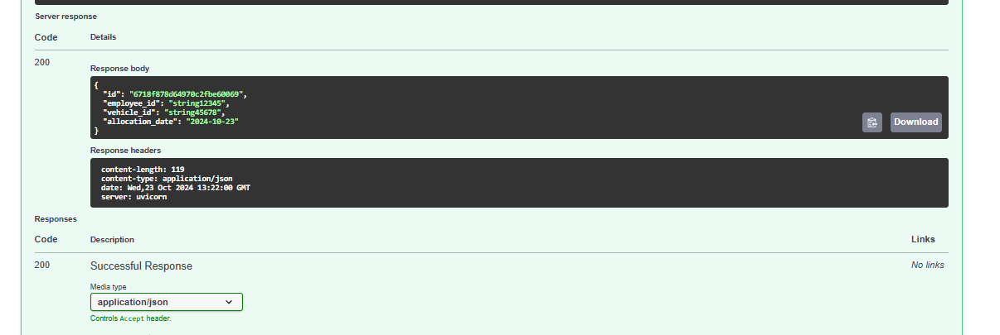

# Vehicle Allocation System

## Overview

This project is a FastAPI-based vehicle allocation system for employees. It allows employees to allocate vehicles for specific days, ensuring no double bookings occur. The system includes features for creating, reading, updating, and deleting allocations, as well as a history report of all allocations.

## Table of Contents

- [Prerequisites](#prerequisites)
- [Installation](#installation)
- [Running the Project](#running-the-project)
- [API Endpoints](#api-endpoints)
- [Deployment](#deployment)
- [Maintenance](#maintenance)
- [Contributing](#contributing)
- [License](#license)

## Prerequisites

- Python 3.8 or higher
- MongoDB server (local or cloud instance)
- Virtual environment (recommended)

## Installation

1. **Clone the repository:**

   ```bash
   git clone https://github.com/mosfeqahamed/fast_api_allocation.git
   cd fast_api_allocation

# On Windows
python -m venv venv
venv\Scripts\activate

# On macOS/Linux
python3 -m venv venv

source venv/bin/activate

Again comeback to the main project directory

pip install -r requirements.txt

Ensure you have a MongoDB instance running and update the connection string in your config.py file.

-Start the FastAPI server using Uvicorn:

uvicorn main:app --reload

Open your browser and navigate to http://127.0.0.1:8000/docs to access the interactive API documentation (Swagger UI).

# API Endpoints
- POST /allocations/ - Create a new vehicle allocation.
- GET /allocations/ - Retrieve all allocations.
- GET /allocations/{allocation_id} - Retrieve a specific allocation by ID.
- PUT /allocations/{allocation_id} - Update a specific allocation by ID.
- DELETE /allocations/{allocation_id} - Delete a specific allocation by ID.
- GET /allocations/history/ - Retrieve allocation history, optionally filtered by employee or vehicle ID.